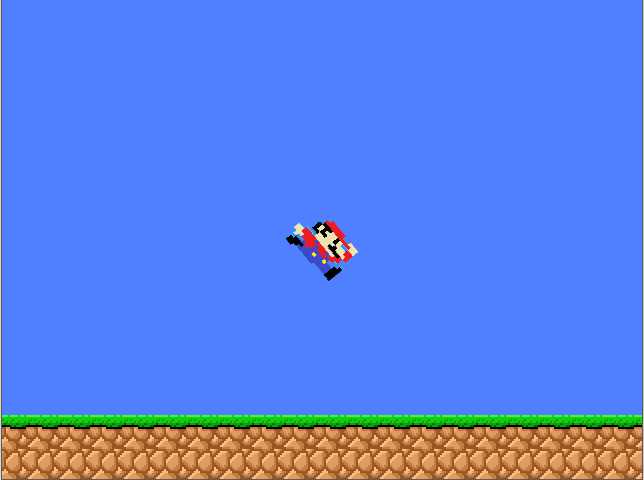

# SimpleGL

A simple graphics library which I created for educational purposes. I have used this library for learning people C++ programing in my science club at university.

It's still using old OpenGL 2.1 but I am planning to move to modern OpenGL.

Based on : GLFW , FTGL , SOIL2

## Usage
- Open Visual Studio solution with two projects
- First build SimpleGL project which creates static lib
- Then build SimpleGL_Example
- If everything succeds there should be lib and example exe files in build folder
- Example application is simple jumping mario animation which you can control whith arrows
- To use library link static lib to your project

## Features
- Window creation and handling
- Easy primitives rendering
- Font rendering
- Single and Double buffered rendering
- Images loading
- Mouse and Keyboard handling
- Screenshots

## Code example

```c++
#include "SimpleGL.h"     // Include basic SimpleGL functionality

int main()
{
  initGL(800, 600);       // Create 800x600 pixels window
  
  while(true)
  {
    setColor(255,0,0);    // Set red color
    circle(400,300,50);   // Draw circle in the middle of screen
    
    swap();               // Show circle on screen and clear buffer

    checkEvents();        // Check for user input
  }

  return 0;
}
```

## Example application

Example application involves jumping mario animation. Mario can be controlled with arrows, mouse buttons rotate camera.
All code used for this example is just **200 lines**

## Screenshot of example program


